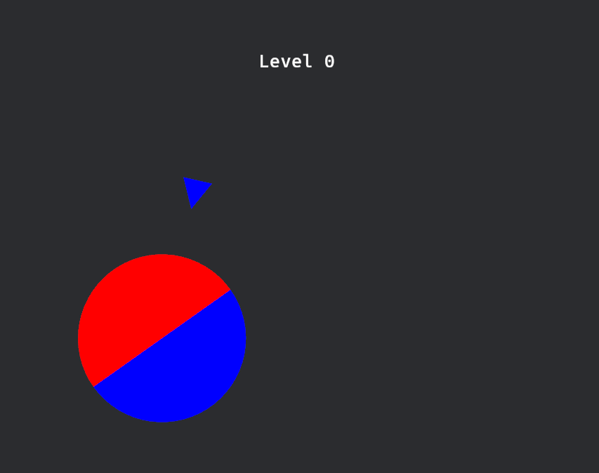

# Rotary Game

Itch page: https://celestesystems.itch.io/rotary

## Overview
Rotary Game is a 2D game built using the Bevy game engine. This game was built in one day, to fulfill a challenge my girlfriend gave me when she noticed that all my projects were too large a scope for me to ever finish them. I would probably not be saying that in the README if not for the fact that my girlfriend is actually the one writing this :P



## How to play
Your are a blue and red circle. Red and blue enemies will appear and try to kill the player by touching them. Kill the enemies by making them touch the side of the circle with the same color as them. If an enemy touches the opposite color, you lose.

As the game progresses, you will move up the levels, which will make enemies will get faster, spawn more frequently , and you'll have more color to manage.

### Controls
- Move the circle by moving the mouse.
- Rotate the circle by clicking left or right mouse button.

## Building

### Install dependencies (Linux)
To build the project, you need to install the following dependencies:

- ALSA (Advanced Linux Sound Architecture)
- udev (Device Manager for the Linux kernel)

You can install these dependencies using the following command:

```
sudo apt-get install libasound2-dev libudev-dev
```


## Running the Game
To run the game, use the following command:

```
cargo run
```

---

2024, Celeste Systems
